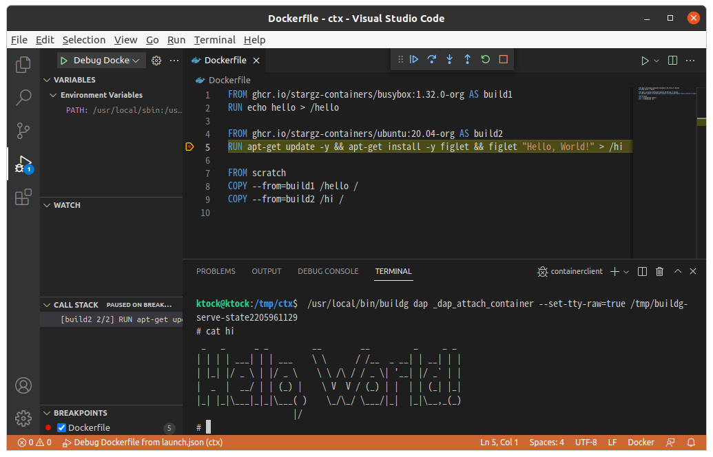

# vscode-buildg: Intractive Debugger for Dockerfile on VS Code

This is an extension for VS Code.
This extension enables interactive debugging of Dockerfile.

This extension depends on [buildg](https://github.com/ktock/buildg), an interactive debugger for Dockerfile.
You need to install buildg on your system to use this extension.

## Features

- Breakpoints and step execution
- Inspecting steps
- Interactive shell on a step with your own debugigng tools
- Rootless execution



## Install

- Requirements
  - [buildg](https://github.com/ktock/buildg) needs to be installed.

Released VSIX files are available from https://github.com/ktock/vscode-buildg/releases

After you download a VSIX file, install it to VS Code as the following.

```
code --install-extension buildg-${VERSION}.vsix
```

> This extension isn't available on Visual Stdio Marketplace as of now. We will distribute it there in the future.

## Extension Settings

You can configure buildg through `launch.json`.
The following propertiess are provided.

- `program` *string* **REQUIRED** : Absolute path to Dockerfile.
- `stopOnEntry` *boolean* : Automatically stop after launch. (default: `true`)
- `target` *string* : Target build stage to build.
- `image` *string* : Image to use for debugging stage.
- `build-args` *array* : Build-time variables.
- `ssh` *array* : Allow forwarding SSH agent to the build. Format: `default|<id>[=<socket>|<key>[,<key>]]`
- `secrets` *array* : Expose secret value to the build. Format: `id=secretname,src=filepath`

Example launch.json is available at [`./sampleWorkspace/.vscode/launch.json`](./sampleWorkspace/.vscode/launch.json)

## Known Issues

## Release Notes

<!-- ### 0.1.0 -->

<!-- Initial release -->

test-ci
